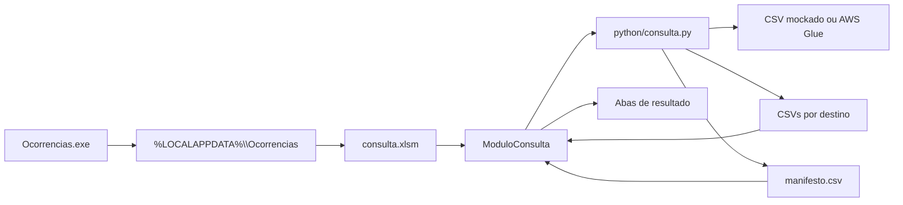

# Arquitetura e decisões

## Objetivo

Oferecer ao analista uma experiência centrada no Excel sem concentrar consulta, regras de dados e integração AWS no VBA. O VBA atua como orquestrador da interface; o Python concentra consulta, validação e roteamento; o lançador C# distribui e prepara o pacote.

## Componentes



### Lançador

`build/Program.cs` é compilado como aplicação Windows. O EXE contém um ZIP incorporado com a planilha e as pastas funcionais.

Ao abrir:

1. calcula o SHA-256 do pacote interno;
2. compara com `%LOCALAPPDATA%\Ocorrencias\.pacote.sha256`;
3. extrai ou atualiza o conteúdo quando a assinatura mudou;
4. executa a preparação configurada, caso necessária;
5. abre `%LOCALAPPDATA%\Ocorrencias\consulta.xlsm`.

O marcador `.pacote.sha256` controla a versão dos arquivos incorporados. Ele não representa a configuração do ambiente.

### Preparação inicial

`configuracao/ambiente.json` controla a preparação opcional. O marcador `%LOCALAPPDATA%\Ocorrencias\.ambiente-configurado` só é criado depois que todas as regras habilitadas terminam com sucesso.

A preparação:

- preserva arquivos e variáveis que já existam;
- nunca cria variáveis globais da máquina;
- localiza exatamente a versão Python configurada;
- cria um ambiente virtual isolado;
- instala as dependências antes de registrar `Scripts` no `Path`;
- grava `runtime/python-executavel.txt` para a macro usar o Python correto.

O marcador de ambiente permanece mesmo quando uma nova versão do pacote é extraída. Se uma atualização exigir nova preparação, a remoção controlada desse marcador deve fazer parte do procedimento de implantação.

### Macro VBA

`ExecutarConsultaPython`:

1. lê `runtime/python-executavel.txt`;
2. executa `python/consulta.py`, passando a pasta `saida`;
3. aguarda o término do processo;
4. em caso de falha, lê `saida/erro_consulta.txt` e mostra uma mensagem;
5. em caso de sucesso, lê `saida/manifesto.csv`;
6. limpa e importa cada CSV na aba indicada;
7. registra data e hora em `Distribuição!E8`.

Não há mensagem de confirmação no sucesso. A ausência de erro e a atualização do horário são o retorno visual para o usuário.

### Python

`python/consulta.py` é responsável por:

- obter o DataFrame;
- confirmar que a coluna de roteamento existe;
- converter seus valores para inteiros;
- validar duplicidade e consistência das rotas;
- impedir que tipos retornados fiquem sem destino;
- remover somente resultados CSV conhecidos da execução anterior;
- gerar um CSV por aba;
- gerar o manifesto consumido pelo VBA;
- escrever uma mensagem de erro simples em `erro_consulta.txt`.

## Contrato entre Python e VBA

O contrato é o arquivo `saida/manifesto.csv`, em UTF-8 com BOM e separado por ponto e vírgula:

```csv
arquivo;aba
resultado_ocorrencias_varejo.csv;Ocorrências Varejo
resultado_ocorrencias_saude.csv;Ocorrências Saúde
```

O Python decide os destinos. O VBA não conhece os códigos de `tipo_atividade`; apenas segue o manifesto. Isso permite alterar regras e nomes de abas sem reescrever a macro.

Os CSVs de resultado também usam ponto e vírgula, UTF-8 com BOM e vírgula decimal, combinação adequada à importação configurada no Excel.

## Por que as decisões foram tomadas

### Regras no Python

As regras ficam próximas ao DataFrame e podem ser testadas sem abrir o Excel. A macro permanece genérica e muda com menos frequência.

### Manifesto

Evita codificar nomes de arquivos e abas no VBA. Também permite que a quantidade de destinos mude.

### Ambiente virtual

Isola as dependências da aplicação e reduz conflitos com outras automações Python do usuário.

### Instalação em `%LOCALAPPDATA%`

Permite que cada usuário tenha sua própria cópia sem exigir instalação global ou escrita em diretórios protegidos.

### Marcadores separados

`.pacote.sha256` responde “esta versão dos arquivos já foi extraída?”. `.ambiente-configurado` responde “a preparação inicial terminou?”. São estados diferentes e não devem ser confundidos.

### Falha para tipo sem rota

Um `tipo_atividade` não configurado sinaliza divergência entre a consulta e a regra de distribuição. Falhar explicitamente evita descartar registros silenciosamente ou enviá-los para uma aba incorreta.

## Limites atuais

- A fonte ainda é o CSV mockado.
- A autenticação AWS automática ainda deve ser incorporada ao Python corporativo.
- A preparação só ocorre quando habilitada no JSON e quando o marcador não existe.
- O gerador incorpora `consulta.xlsm` como está; não injeta automaticamente `vba/ModuloConsulta.bas`.
- O pacote preserva itens preexistentes, portanto não corrige automaticamente uma configuração antiga ou incorreta.

